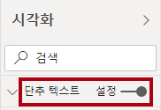

---
lab:
    title: 'Power BI Desktop에서 보고서 디자인, 2부'
    module: '모듈 7 - 보고서 만들기'
---

# **Power BI Desktop에서 보고서 디자인, 2부**

**랩을 완료하는 데 예상되는 시간은 45분입니다.**

이 랩에서는 고급 디자인 기능을 통해 **판매 분석**을 개선합니다.

이 랩의 학습 내용은 다음과 같습니다.

- 슬라이서 동기화

- 드릴스루 페이지 만들기

- 조건부 서식 적용

- 책갈피 만들기 및 사용

### **랩 스토리**

이 랩은 데이터를 준비하여 보고서와 대시보드로 게시하는 전체 스토리로 제작된 랩 시리즈에 포함되어 있는 여러 랩 중 하나입니다. 랩은 원하는 순서로 완료하면 됩니다. 그러나 여러 랩을 진행하려는 경우 처음 10개 랩은 다음 순서로 수행하는 것이 좋습니다.

1. Power BI Desktop에서 데이터 준비

2. Power BI Desktop에서 데이터 로드

3. Power BI Desktop에서 데이터 모델링, 1부

4. Power BI Desktop에서 데이터 모델링, 2부

5. Power BI Desktop에서 DAX 계산 만들기, 1부

6. Power BI Desktop에서 DAX 계산 만들기, 2부

7. Power BI Desktop에서 보고서 디자인, 1부

8. **Power BI Desktop에서 보고서 디자인, 2부**

9. Power BI 대시보드 만들기

10. Power BI 페이지를 매긴 보고서 만들기

11. Power BI Desktop에서 데이터 분석 수행

## **연습 1: 동기화 슬라이서 구성**

이 연습에서는 보고서 페이지 슬라이서를 동기화합니다.

### 작업 1: 시작 - 로그인

이 작업에서는 Power BI에 로그인하여 랩용 환경을 설정합니다.

*중요: Power BI에 이미 로그인했다면 다음 작업부터 진행하세요.*

1. 작업 표시줄에서 Microsoft Edge를 열려면 Microsoft Edge 프로그램 바로 가기를 클릭합니다.

 	

1. Microsoft Edge 브라우저 창에서 **https://powerbi.com** 으로 이동합니다.

 	*팁: Microsoft Edge 즐겨찾기 모음에서 Power BI 서비스 즐겨찾기를 사용할 수도 있습니다.*

1. **로그인** 오른쪽 상단 모서리에 위치)을 클릭합니다.

 	

1. 제공된 계정 세부 정보를 입력합니다.

1. 암호를 업데이트하라는 메시지가 표시되면 제공된 암호를 다시 입력한 다음 새 암호를 입력하고 확인합니다.

 	*중요: 새 암호를 기록해 두어야 합니다.*

1. 로그인 프로세스를 완료합니다.

1. Microsoft Edge에서 로그인 상태를 유지하라는 메시지가 표시되면 **예**를 클릭합니다.

1. Microsoft Edge 브라우저 창의 Power BI 서비스 내 **탐색** 창에서 **내 작업 영역**을 확장합니다.

 	

1. Microsoft Edge 브라우저 창을 열어 둡니다.

### 작업 2 시작 - 보고서 열기

이 작업에서는 시작 보고서를 열어 랩용 환경을 설정합니다.

*중요: 이전 랩을 정상적으로 완료했으며 작업을 계속 이어서 하는 경우 이 작업을 완료하지 말고 다음 작업부터 계속 진행하세요.*

1. Power BI Desktop을 열려면 작업 표시줄에서 Microsoft Power BI Desktop 바로 가기를 클릭합니다.

	

2. 시작 창을 닫으려면 창 왼쪽 위의 **X**를 클릭합니다.

	

3. Power BI 서비스에 로그인하려면 오른쪽 위에 있는 **로그인**을 클릭합니다.

	

4. Power BI 서비스에 로그인하는 데 사용한 것과 같은 계정을 사용하여 로그인 프로세스를 완료합니다.

5. 시작 Power BI Desktop 파일을 열려면 **파일** 리본 탭을 클릭하여 Backstage 뷰를 엽니다.

6. **보고서 열기**를 선택합니다.

	

7. **보고서 찾아보기**를 클릭합니다.

	

8. **열기** 창에서 **D:\DA100\Labs\08-design-report-in-power-bi-desktop-enhanced\Starter** 폴더로 이동합니다.

9. **판매 분석** 파일을 선택합니다.

10. **열기**를 클릭합니다.

	

11. 정보 창이 열릴 수도 있는데 모두 닫으면 됩니다.

12. 파일 복사본을 만들려면 **파일** 리본 탭을 클릭하여 Backstage 뷰를 엽니다.

13. **다른 이름으로 저장**을 선택합니다.

	

14. 변경 내용을 적용하라는 메시지가 표시되면 **적용**을 클릭합니다.

	

15. **다른 이름으로 저장** 창에서 **D:\DA100\MySolution** 폴더로 이동합니다.

16. **저장**을 클릭합니다.

	

### **작업 3: 슬라이서 동기화**

이 작업에서는 **연도** 및 **지역** 슬라이서를 동기화합니다.

***Power BI Desktop에서 보고서 디자인, 1부** 랩에서 만든 보고서의 개발을 계속 진행할 것입니다.*

1. Power BI Desktop의 **개요** 페이지에서 **연도** 슬라이서를 **FY2018**로 설정합니다.

2. **실적** 페이지로 이동하면 **연도** 슬라이서가 다른 값임을 알 수 있습니다.

	*슬라이서가 동기화되지 않으면 데이터가 잘못 표시되고 보고서 사용자의 불만을 야기할 수 있습니다. 이제 보고서 슬라이서를 동기화합니다.*

3. **개요** 페이지로 돌아와서 **연도** 슬라이서를 선택합니다.

4. **창 표시** 그룹 내의 **보기** 리본 탭에서 **슬라이서 동기화**를 클릭합니다.

	

5. **슬라이서 동기화** 창(**시각화** 창 왼쪽에 위치)에서 두 번째 열(동기화 상태를 나타냄)에서 **개요** 및 **내 실적** 페이지에 대한 체크박스를 선택합니다.

	

6. **개요** 페이지에서 **지역** 슬라이서를 선택합니다.

7. **개요** 및 **수익** 페이지와 슬라이서를 동기화합니다.

	

8. 다른 필터 옵션을 선택하여 슬라이서 동기화를 테스트한 다음 동기화된 슬라이서가 동일한 선택 항목으로 필터링되는지 확인합니다.

9. **동기화 슬라이서** 페이지를 닫으려면 창의 오른쪽 상단에 있는 **X**를 클릭합니다.

	

## **연습 2: 드릴스루 구성**

이 연습에서는 새 페이지를 만들고 드릴스루 페이지로 구성합니다. 디자인을 완료하면 페이지는 다음과 같은 모습이 됩니다.

### **작업 1: 드릴스루 페이지 만들기**

이 작업에서는 새 페이지를 만들고 이것을 드릴스루 페이지로 구성합니다.

1. **제품 세부 정보**라는 새 보고서 페이지를 추가합니다.

	

2. **제품 세부 정보** 페이지 탭을 마우스 오른쪽 단추로 클릭한 다음 **페이지 숨기기**를 선택합니다.

	

	*보고서 사용자는 직접 드릴스루 페이지로 이동할 수 없습니다. 다른 페이지의 시각적 개체에서 액세스해야 합니다. 이 랩의 마지막 연습에서 페이지로 드릴스루하는 방법을 배웁니다.*

3. **시각화** 창 아래의 **드릴스루** 섹션에서 **제품**을 추가합니다. **| 범주** 필드를 **여기에 드릴스루 필드 추가** 상자에 추가합니다.

	*이 랩에서는 단축 표기를 사용해 필드를 참조합니다. 다음과 같이 표시됩니다. **제품 | Category**. 이 예제에서 **Product**는 테이블 이름이고 **Category**는 필드 이름입니다.*

	

4. 드릴스루 페이지를 테스트하려면 드릴스루 필터 카드에서 **자전거**를 선택합니다.

	

5. 보고서 페이지의 왼쪽 위에 화살표 단추가 있습니다.

	

	*드릴스루 웰/영역에 필드를 추가하면 단추가 자동으로 추가됩니다/. 이를 통해 사용자가 드릴스루한 페이지로 다시 이동할 수 있습니다.*

6. 페이지에 **카드** 시각적 개체를 추가한 다음 크기를 조정하고 단추 오른쪽에 배치하여 페이지의 나머지 너비를 채웁니다.

	

	

7. **제품** 끌기 **|** 카드 시각적 개체로 **범주** 필드 넣기.

8. 시각적 개체에 대한 형식 옵션을 구성한 다음 **범주 레이블** 속성을 **끄기**로 설정합니다.

	

9. **배경 색상** 속성을 밝은 회색 음영으로 설정합니다.

10. 페이지에 **테이블** 시각적 개체를 추가한 다음 크기를 조정하고 카드 시각적 개체 아래에 배치하여 페이지의 나머지 공간을 채웁니다.

	

	

11. 다음 필드를 시각적 개체에 추가합니다.

	- Product | Subcategory

	- Product | Color

	- Sales | Quantity

	- Sales | Sales

	- Sales | Profit Margin

12. 시각적 개체에 대한 형식 옵션을 구성하고 **그리드** 섹션에서 **텍스트 크기** 속성을 **20pt**로 설정합니다.

	*드릴스루 페이지의 디자인이 거의 완료되었습니다. 다음 연습에서 조건부 서식을 사용하여 페이지를 개선할 것입니다.*

## **연습 3: 조건부 서식 추가**

이 연습에서는 조건부 서식으로 드릴스루 페이지를 향상시킵니다. 디자인을 완료하면 페이지는 다음과 같은 모습이 됩니다.

### **작업 1: 조건부 서식 추가**

이 작업에서는 조건부 서식을 사용하여 드릴스루 페이지를 향상시킵니다.

1. 테이블 시각적 개체를 선택합니다.

2. 시각화 창에서 **이익률** 값의 아래쪽 화살표를 클릭하고 **조건부 서식**을 선택합니다. **| 아이콘**.

	

3. **아이콘 – 이익률** 창의 **아이콘 레이아웃** 드롭다운 목록에서 **데이터의 오른쪽**을 선택합니다.

	

4. 중간 규칙을 삭제하려면 노란색 삼각형 왼쪽에 있는 **X**를 클릭합니다.

	

5. 첫 번째 규칙(빨간색 다이아몬드)을 다음과 같이 구성합니다.

	- 두 번째 컨트롤에서 값 제거

	- 세 번째 컨트롤에서 **숫자** 선택

	- 다섯 번째 컨트롤에서 **0** 입력

	- 여섯 번째 컨트롤에서 **숫자** 선택

6. 두 번째 규칙(녹색 원)을 다음과 같이 구성합니다.

	- 두 번째 컨트롤에서 **0** 입력

	- 세 번째 컨트롤에서 **숫자** 선택

	- 다섯 번째 컨트롤에서 값 제거

	- 여섯 번째 컨트롤에서 **숫자** 선택

	

	*이익률 값이 0 미만인 경우 빨간색 다이아몬드를 표시하고 값이 0보다 크거나 같으면 녹색 원을 표시하는 것으로 규칙을 해석할 수 있습니다.*

7. **확인**을 클릭합니다.

	

8. 테이블 시각적 개체에서 아이콘이 올바르게 표시되는지 확인합니다.

	

9. **색상** 필드에 대한 배경 색상 조건부 서식을 구성합니다.

10. **배경색 – 색상** 창의 **다음 형식 사용** 드롭다운 목록에서 **필드 값**을 선택합니다.

	

11. **필드 기반** 드롭다운 목록에서 **제품 | 형식 지정 | 배경 색 형식**을 선택합니다.

	

12. **확인**을 클릭합니다.

	

13. 이전 단계를 반복하여 **제품**을 사용하여 **색상** 필드에 대한 글꼴 색상 조건부 서식을 구성합니다. **| 형식 지정 | 글꼴 색상 형식** 필드

	*배경색과 글꼴 색은 **Power BI Desktop에서 데이터 준비** 랩에서 사용했던 **ColorFormats.csv** 파일에서 가져온 다음 **Power BI Desktop에서 데이터 로드** 랩에서 만든 **Product** 쿼리와 통합한 것입니다.*

## **연습 4: 책갈피 및 단추 추가**

이 연습에서는 단추를 사용하여 **실적** 페이지를 개선하여 보고서 사용자가 표시할 시각적 개체 유형을 선택할 수 있도록 합니다. 디자인을 완료하면 페이지는 다음과 같은 모습이 됩니다.

### **작업 1: 책갈피 추가**

이 작업에서는 두 개의 책갈피를 추가하고 월별 판매량/대상 시각적 개체를 각각 표시합니다.

1. **실적** 페이지로 이동합니다.

2. **창 표시** 그룹 내의 **보기** 리본 탭에서 **책갈피**를 클릭합니다.

	

3. **창 표시** 그룹 내의 **보기** 리본 탭에서 **선택**을 클릭합니다.

	

4. **선택** 창에서 **월별 판매 및 목표** 항목 중 하나 옆에 시각적 개체를 숨기려면 눈 아이콘을 클릭합니다.

	

5. **책갈피** 창에서 **추가**를 클릭합니다.

	

6. 책갈피의 이름을 바꾸려면 책갈피를 두 번 클릭합니다.

7. 표시된 차트가 가로 막대형 차트인 경우 책갈피 이름을 **가로 막대형 차트 켜기**로 바꾸고 그렇지 않은 경우 책갈피 이름을 **세로 막대형 차트 켜기**로 바꿉니다.

8. 책갈피를 편집하려면 **책갈피** 창에서 책갈피 위를 커서로 가리키고 줄임표를 클릭한 다음 **데이터**를 선택합니다.

	

	***데이터** 옵션을 사용하지 않도록 설정하면 책갈피가 현재 필터 상태를 사용하지 않습니다. 이 옵션이 중요한 이유는, 이렇게 하지 않으면 책갈피는 **연도** 슬라이서를 통해 현재 적용되어 있는 필터를 영구적으로 사용하기 때문입니다.*

9. 책갈피를 업데이트하려면 줄임표를 다시 클릭하고 **업데이트**를 선택합니다.

	

	*다음 단계에서는 두 번째 시각적 개체에 표시할 두 번째 책갈피를 만들고 구성합니다.*

10. **선택** 창에서 두 **월별 판매 및 목표** 항목의 가시성을 전환합니다.

	*즉, 보이는 시각적 개체를 숨기고 숨겨진 시각적 개체를 표시합니다.*

	

11. 두 번째 책갈피를 만들고 적절하게 이름을 지정합니다. (**열 차트 켜기** 또는 **막대형 차트 켜기)**

	

12. 필터를 무시하도록 두 번째 책갈피를 구성(**데이터** 옵션 끄기)하고 책갈피를 업데이트합니다.

13. **선택** 창에서 두 시각적 개체를 모두 표시하려는 경우 숨겨진 시각적 개체만 표시하면 됩니다.

14. 두 시각적 개체의 크기를 조정하고 위치를 변경하여 다중 카드 시각적 개체 아래에 있는 페이지를 채우고 서로 완전히 겹치게 합니다.

	*팁: 가려진 시각적 개체를 선택하려면 **선택** 창에서 선택합니다.*

	

15. **책갈피** 창에서 각 책갈피를 선택하면 하나의 시각적 개체만 볼 수 있습니다.

	*다음 디자인 단계에서는 페이지에 두 개의 단추를 추가하여 보고서 사용자가 책갈피를 선택할 수 있도록 합니다.*

### **작업 2 단추 추가**

이 작업에서는 두 개의 단추를 추가하고 각 단추에 책갈피 작업을 할당합니다.

1. 리본의 **삽입**에서 **요소** 그룹 내의 **단추**를 클릭한 다음 **공백**을 선택합니다.

	

2. **연도** 슬라이서 바로 아래에 단추를 배치합니다.

3. 단추를 선택하고 **시각화** 창에서 **단추 텍스트** 속성을 **켜기**로 설정합니다.

	

4. **단추 텍스트** 섹션을 확장한 다음 **단추 텍스트** 상자에 **막대형 차트**를 입력합니다.

5. **배경** 섹션을 확장하고 보색을 사용하여 배경색을 설정합니다.

6. **작업** 속성을 **켜기**로 전환합니다(목록의 맨 아래에 있음).

	

7. **작업** 섹션을 펼친 다음 **형식** 드롭다운 목록을 **책갈피**로 설정합니다.

8. **책갈피** 드롭다운 목록에서 **막대형 차트 켜기**를 선택합니다.

	

9. 복사 및 붙여넣기를 사용하여 단추의 복사본을 만든 후 다음과 같이 새 단추를 구성합니다.

	*팁: 복사 및 붙여넣기의 바로 가기 명령은 **Ctrl+C** -> **Ctrl+V**입니다.*

	- **단추 텍스트** 속성을 **열 차트**로 설정

	- **작업** 섹션에서 **책갈피** 드롭다운 목록을 **세로 막대형 차트 켜기**로 설정

	*이제 판매 분석 보고서 디자인이 완료되었습니다.*

### **작업 3: 보고서 게시**

이 작업에서는 보고서를 게시합니다.

1. **개요** 페이지를 선택합니다.

2. **연도** 슬라이서에서 **FY2020**을 선택합니다.

3. **지역** 슬라이서에서 **모두 선택**을 선택합니다.

4. Power BI Desktop 파일을 저장합니다.

	*파일은 항상 Power BI 서비스에 게시하기 전에 저장해야 합니다.*

5. **홈** 리본 탭의 **공유** 그룹 내부에서 **게시**를 클릭합니다.

	

6. **Power BI에 게시** 창에서 **내 작업 영역**이 선택된 것을 확인할 수 있습니다.

7. 보고서를 게시하려면 **선택**을 클릭합니다.

	

8. 데이터 세트를 바꾸라는 메시지가 표시되면 **바꾸기**를 클릭합니다.

9. 게시가 정상적으로 완료되었으면 **확인**을 클릭합니다.

	

10. Power BI Desktop을 닫습니다.

	*다음 연습을 진행하면서 Power BI 서비스에서 보고서를 살펴볼 것입니다.*

## **연습 5: 보고서 살펴보기**

이 연습에서는 Power BI 서비스의 보고서를 살펴봅시다.

### **작업 1: 보고서 살펴보기**

이 작업에서는 Power BI 서비스의 보고서를 살펴봅시다.

1. Microsoft Edge 브라우저 창의 Power BI 서비스 내 **탐색** 창에서 **판매 분석** 보고서를 클릭합니다.

2. 드릴스루 보고서를 테스트하려면 **개요** 페이지의 **범주별 수량** 시각적 개체에서 **의류** 막대를 마우스 오른쪽 단추로 클릭한 다음 **드릴스루**를 선택합니다. **| 제품 세부 정보**.

	

3. **제품 세부 정보** 페이지는 **의류**용입니다.

4. 원본 페이지로 돌아가려면 페이지 왼쪽 위 모서리에서 화살표 단추를 클릭합니다.

5. **내 실적** 페이지를 선택합니다.

6. 각 단추를 클릭한 다음 표시되는 다른 시각적 개체를 확인합니다.

### **작업 2 완료**

이 작업에서는 랩을 완료합니다.

1. 작업 영역으로 돌아오려면 창 웹 페이지에 가로로 표시된 배너에서 **내 작업 영역**을 클릭합니다.

	

2. Microsoft Edge 브라우저 창을 열어 둡니다.
