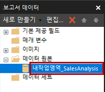
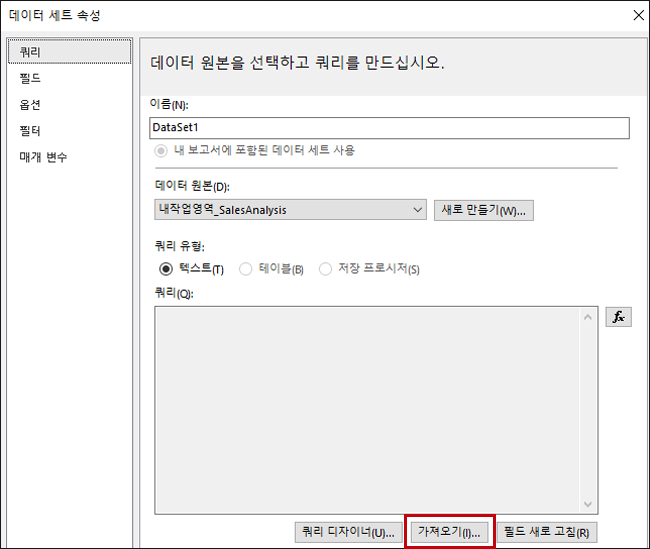



### 랩 13A

페이지를 매긴 보고서 만들기

# 개요

**랩을 완료하는 데 예상되는 시간은 45분입니다.**

이 랩에서는 Power BI Report Builder를 사용하여 **AdventureWorksDW2020** SQL Server 데이터베이스에서 데이터 원본을 제공하는 픽셀 퍼펙트한 페이지 번호를 매긴 보고서 레이아웃을 개발합니다. 데이터 원본 및 데이터 집합을 만들고 보고서 매개 변수도 구성합니다. 보고서 레이아웃을 사용하면 여러 페이지에 걸쳐 데이터를 렌더링하고 PDF 및 기타 형식으로 내보낼 수 있습니다.

최종 보고서는 다음과 같습니다.  


이 랩의 학습 내용은 다음과 같습니다.

* Power BI Report Builder 사용

* 다중 페이지 보고서 레이아웃 디자인

* 데이터 원본 정의

* 데이터 집합 정의

* 보고서 매개 변수 만들기

* PDF로 보고서 내보내기

# 연습 1: 시작

이 연습에서는 Power BI 보고서 작성기를 열어 보고서를 만든 다음 저장합니다.

### 작업 1: 보고서 만들기

이 작업에서는 Power BI 보고서 작성기를 열어 보고서를 만든 다음 저장합니다.

1. 작업 표시줄에서 Power BI Report Builder를 열려면 **Power BI Report Builder** 바로 가기를 클릭합니다.

	

2. Power BI Report Builder 창에서 새 보고서를 만들려면 **시작** 창에서 **빈 보고서**를 클릭합니다.

	

3. 보고서를 저장하려면 **파일** 탭(왼쪽 상단에 있음)을 클릭한 다음 **저장**을 선택합니다.

	

4. **보고서로 저장** 창에서 **D:\DA100\MySolution** 폴더로 이동합니다.

5. **이름** 상자에 **판매 주문 보고서**를 입력합니다.

6. **저장**을 클릭합니다.

# 연습 2: 보고서 레이아웃 개발

이 연습에서는 보고서 레이아웃을 개발하고 최종 보고서 디자인을 살펴봅니다.

### 작업 1: 보고서 헤더 구성

이 작업에서는 보고서 헤더를 구성합니다.

1. 보고서 디자이너에서 본문 영역과 보고서 푸터 영역으로 구성된 기본 보고서 레이아웃을 확인합니다.

	

	*본문에는 보고서 제목을 위한 단일 텍스트 상자가 포함되어 있으며, 보고서 바닥글에는 보고서 실행 시간을 설명하는 단일 텍스트 상자가 포함되어 있습니다.*

	*기본 디자인은 첫 번째 렌더링된 페이지의 본문에서 보고서 제목을 한 번 렌더링합니다. 그러나 이제 보고서 헤더 영역을 추가하고 보고서 제목 텍스트 상자를 이 지역으로 이동하여 보고서 디자인을 수정합니다. 이렇게 하면 보고서 제목이 모든 페이지에서 반복됩니다. 회사 로고 이미지도 추가합니다*.

2. 보고서 헤더 영역을 추가하려면 **삽입** 리본 탭의 **머리글 및 바닥글** 그룹 내에서 **머리글**을 클릭한 다음 **머리글 추가**를 선택합니다.

	

3. 보고서 디자이너에서 보고서 헤더 영역이 보고서 레이아웃에 추가되었음을 알 수 있습니다.

4. 본문 텍스트 상자를 선택하려면 "클릭하여 제목 추가" 텍스트 상자를 클릭합니다.

5. 텍스트 상자를 이동하려면 네 개의 머리가 있는 화살표 아이콘을 클릭한 다음 헤더 영역으로 끌어와서 보고서 헤더 영역의 맨 왼쪽에 놓습니다.

	

6. 보고서 제목 텍스트 상자의 텍스트를 수정하려면 텍스트 상자 내부를 클릭한 후 다음을 입력합니다. **판매 주문 보고서**

	*텍스트 상자의 크기를 조정하려면 먼저 **속성** 창을 엽니다. 위치 및 크기 속성을 세분화하여 컨트롤하려면 **속성** 창을 사용해야 합니다.*

7. **뷰** 리본 탭의 **표시/숨기기** 그룹 내부에서 **속성**을 확인합니다.

	

8. 보고서 제목 텍스트 상자를 선택하려면 먼저 텍스트 상자 외부의 영역을 클릭한 다음 텍스트 상자를 다시 클릭합니다.

	*텍스트 상자를 선택하면 텍스트 상자의 테두리가 강조 표시되고, 테두리에 크기 조정 핸들(작은 원)이 나타납니다*.

9. **속성** 창(오른쪽에 위치)에서 목록을 아래로 스크롤하여 **위치** 그룹을 찾습니다.

	

	***위치** 그룹을 사용하면, 보고서 항목의 위치와 크기에 대한 정확한 값을 설정할 수 있습니다.*

	*이 랩에서 지시한 대로 값을 입력하는 것이 중요합니다. 랩의 끝에서 페이지를 렌더링하려면 픽셀 퍼펙트 레이아웃이 필요합니다*.

10. **위치** 그룹 내에서 **위치** 그룹을 확장하고 **왼쪽** 및 **상단** 속성이 각각 **0in** 으로 설정되어 있는지 확인합니다.

	*랩 가상 머신의 지역 설정이 미국으로 설정되어 있기 때문에 위치 및 크기 단위는 인치입니다. 해당 지역에서 메트릭 측정값을 사용하는 경우 센티미터는 기본 단위입니다.*

11. **위치** 그룹 내에서 **크기** 그룹을 확장한 다음 **너비** 속성을 **4**로 설정합니다.

	

12. 이미지를 삽입하려면 **삽입** 리본 탭의 **보고서 항목** 그룹 내부에서 **이미지**를 클릭합니다.

	

13. 보고서 디자인에 이미지를 추가하려면 보고서 제목 텍스트 상자 오른쪽에 있는 보고서 헤더 영역 내부를 클릭합니다.

14. **이미지 속성** 창에서 이미지 파일에서 가져오려면 **가져오기**를 클릭합니다.

	

15. **열기** 창에서 **D:\DA100\Data** 폴더로 이동한 다음 **AdventureWorksLogo.jpg** 파일을 선택합니다.

16. **열기**를 클릭합니다.

17. **이미지 속성** 창에서 **확인**을 클릭합니다.

18. 보고서 디자이너에서 이미지가 추가되고 선택됨을 알 수 있습니다.

19. 이미지를 배치하고 크기를 조정하려면 **속성** 창에서 다음 속성을 구성합니다.

	|  속성 | 값 |   |   |
	|  ------  |  ---- | ---- | ---- |
	|  직위 | 위치 | 왼쪽 | 5 |
	|  직위 | 위치 | 상단 | 0 |
	|  직위 | 크기 | 너비 | 1  |
	|  위치 | 크기 | 너비 | 1 |


20. 보고서 헤더 지역의 크기를 조정하려면 먼저 지역의 빈 영역을 클릭하여 지역을 선택합니다.

21. **속성** 창에서 **일반 | 높이** 속성을 **1**로 설정합니다.

22. 보고서 헤더 영역에 단일 텍스트 상자와 이미지가 포함되어 있으며 다음과 같은지 확인합니다.

	

23. 보고서를 저장하려면 **파일** 탭에서 **저장**을 클릭합니다.

	*팁: 왼쪽 상단에 있는 디스크 아이콘을 클릭할 수도 있습니다*.

	

	*이제 데이터베이스 쿼리 결과를 검색하도록 보고서를 구성할 준비가 되었습니다*.

### 작업 2: 데이터 검색

이 작업에서는 **AdventureWorksDW2020** SQL Server 데이터베이스에서 쿼리 결과를 검색하기 위해 데이터 원본 및 데이터 세트를 만듭니다.

1. **보고서 데이터** 창(왼쪽에 위치)에서 **데이터 원본** 폴더를 마우스 오른쪽 단추로 클릭한 다음 **데이터 원본 추가**를 선택합니다.

	

	*클라우드 데이터베이스 혹은 온-프레미스 데이터베이스, Power BI 데이터 세트에서 데이터를 검색할 수 있습니다.*

2. **데이터 원본 속성** 창의 **이름** 상자에서 텍스트를 **AdventureWorksDW2020**으로 바꿉니다.

3. **연결 형식 선택** 드롭다운 목록에서 **Microsoft SQL Server**가 선택되었음을 알 수 있습니다.

4. 연결 문자열을 빌드하려면 **빌드**를 클릭합니다.

	

5. **연결 속성** 창의 **서버 이름** 상자에 **localhost**를 입력합니다.

	*랩에서 **localhost**를 사용하여 SQL Server 데이터베이스에 연결합니다. 그러나 여러분 자신을 위한 솔루션을 만들 때 권장되는 방법은 아닙니다. 게이트웨이 데이터 소스가 **localhost***를 해결할 수 없기 때문입니다.

6. **데이터베이스 이름 선택 또는 입력** 드롭다운 에서 **AdventureWorksDW2020**을 선택합니다.

7. **확인**을 클릭합니다.

8. **데이터 원본 속성** 창에서 **확인**을 클릭합니다.

9. **보고서 데이터** 창에 **AdventureWorksDW2020** 데이터 원본이 추가되었습니다.

	

10. 데이터 세트를 만들려면 **보고서 데이터** 창에서 **AdventureWorksDW2020** 데이터 소스를 마우스 오른쪽 단추로 클릭한 다음 **데이터 세트 추가**를 선택합니다.

	

	*보고서 데이터 세트는 목적 및 구조가 Power BI 데이터 세트와 다릅니다*.

11. **데이터 세트** 속성 창에서 **이름** 상자의 텍스트를 **SalesOrder**로 바꿉니다.

12. 미리 정의된 쿼리를 가져오려면 **가져오기**를 클릭합니다.

	

13. **쿼리 가져오기** 창에서 **D:\DA100\Lab13A\Assets** 폴더로 이동한 다음 **SalesOrder.sql** 파일을 선택합니다.

14. **열기**를 클릭합니다.

15. **쿼리** 상자에서 쿼리를 검토하고 쿼리 텍스트의 맨 아래로 스크롤해야 합니다.

	*쿼리 문의 세부 정보를 이해하는 것은 중요하지 않습니다. 판매 주문 줄의 세부 정보를 검색하도록 설계되었습니다. WHERE 절에는 쿼리 결과를 단일 판매 주문으로 제한하는 조건자가 포함됩니다. ORDER BY 절을 사용하면 행이 줄 번호 순서로 반환됩니다*.

16. 쿼리 매개 변수를 나타내는 WHERE 절에서 **@SalesOrderNumber**가 사용됩니다.

	

	*쿼리 매개 변수는 쿼리 실행 시간에 전달되는 값의 자리 표시자입니다. 보고서 사용자에게 단일 판매 주문 번호를 입력하라는 메시지를 표시한 다음 이를 쿼리 매개 변수로 전달하는 보고서 매개 변수를 구성합니다*.

17. **확인**을 클릭합니다.

18. **보고서 데이터** 창에서 **SalesOrder** 데이터 집합 및 해당 필드가 추가된 것을 확인합니다.

	

	*필드는 보고서 레이아웃에서 데이터 영역을 구성하는 데 사용됩니다. 데이터 세트 쿼리 열에서 파생된 것입니다*.

19. 보고서를 저장합니다.

### 작업 3: 보고서 매개 변수를 구성합니다.

이 작업에서는 기본 값으로 보고서 매개 변수를 구성합니다.

1. **보고서 데이터** 창에서 **매개 변수** 폴더를 확장하여 **SalesOrderNumber** 보고서 매개 변수를 표시합니다.

	

	*데이터 집합이 만들어졌을 때 **SalesOrderNumber** 보고서 매개 변수가 자동으로 추가되었습니다. 데이터 세트 쿼리에 **@SalesOrderNumber** 쿼리 매개 변수가 포함되어 있기 때문입니다*.

2. 보고서 매개 변수를 편집하려면 **SalesOrderNumber** 보고서 매개 변수를 마우스 오른쪽 단추로 클릭한 다음 **매개 변수 속성**을 선택합니다.

	

3. **매개 변수 속성 보고서** 창의 왼쪽에서 **기본 값** 페이지를 선택합니다.

	

4. **값 지정** 옵션을 선택합니다.

	

5. 기본값을 추가하려면 **추가**를 클릭합니다.

6. **값** 드롭다운 목록에서 텍스트를 **43659**로 바꿉니다.

	

	*판매 주문 43659는 보고서 디자인을 테스트하는 데 처음 사용할 값입니다*.

7. **확인**을 클릭합니다.

8. 보고서를 저장합니다.

	*이제 판매 주문을 설명하는 텍스트 상자를 추가하여, 보고서 헤더 지역 설계를 완료합니다*.

### 작업 4: 보고서 헤더 레이아웃 마무리

이 작업에서는 텍스트 상자를 추가하여 보고서 헤더 영역 디자인을 완료합니다.

1. 보고서 머리글 영역에 텍스트 상자를 추가하려면 **삽입** 리본 탭에서, **보고서 항목** 그룹 내부에서, **텍스트 상자**를 클릭합니다.

	

2. 보고서 제목 텍스트 상자 바로 아래에 있는 보고서 헤더 영역 내부를 클릭합니다.

3. 텍스트 상자 안에 **판매 주문:** 입력 후 공백을 입력합니다.

4. 자리 표시자를 삽입하려면 스페이스를 입력한 직후에 마우스 오른쪽 단추를 클릭하고 **자리 표시자 만들기**를 선택합니다.

	

5. **자리 표시자 속성** 창의 **값** 드롭다운 목록 오른쪽에서 **fx** 단추를 클릭합니다.

	

	***fx** 단추를 사용하면 사용자 지정 식을 입력할 수 있습니다.  이 식은 판매 주문 번호를 반환하는 데 사용됩니다*.

6. **식** 창의 **범주** 목록에서 **매개 변수**를 선택합니다.

	

7. **값** 목록에서 **SalesOrderNumber** 매개 변수를 두 번 클릭합니다.

8. 식 상자에서 **SalesOrderNumber** 보고서 매개 변수에 대한 프로그래밍 방식 참조가 추가되었는지 확인합니다.

	

9. **확인**을 클릭합니다.

10. **자리 표시자 속성** 창에서 **확인**을 클릭합니다.

11. 보고서 헤더 영역의 빈 영역을 클릭한 다음 새 텍스트 상자를 선택합니다.

12. **속성** 창에서 다음 위치 속성을 구성합니다.

	|  속성                    |  값|
	|  :---                        |  :--- |
	|  위치 \| 위치 \| 왼쪽|  0    |
	|  위치 \| 위치 \| 상단 |  0.5  |
	|  위치 \| 크기 \| 너비   |  4    |
	|  위치 \| 크기 \| 높이  |  0.25 |

13. 새 텍스트 상자 안에서 텍스트 상자 텍스트의 일부를 포맷하려면 **판매 주문:** 텍스트만 선택합니다.

	

14. **홈** 리본 탭의 **글꼴** 그룹 내부에서 **굵게** 명령을 클릭합니다.

	

15. 보고서 헤더 지역에 다른 텍스트 상자를 추가한 다음 텍스트 **재판매인:** 을 입력한 후 공간을 입력합니다.

	*팁: 캔버스를 마우스 오른쪽 단추로 클릭하여 텍스트 상자를 추가한 다음 **텍스트 상자 삽입**을 | 선택할 수도 있습니다*.

16. 공간 뒤에 자리 표시자를 삽입한 다음 자리 표시자의 값을 설정하여 식을 사용합니다.

17. **식** 창의 **범주** 목록에서 **데이터 집합**을 선택합니다.

	

18. 식 값은 **첫 번째(재판매인)** 값을 기준으로 합니다.

19. **속성** 창에서 다음 위치 속성을 구성합니다.

	|  속성                    |  값|
	|  :---                        |  :--- |
	|  위치 \| 위치 \| 왼쪽|  0    |
	|  위치 \| 위치 \| 상단 |  0.75 |
	|  위치 \| 크기 \| 너비   |  4    |
	|  위치 \| 크기 \| 높이  |  0.25 |
	

20. **재판매인:** 텍스트를 굵게로 설정합니다.

21. 보고서 머리글 영역에 세 번째(마지막) 텍스트 상자를 추가한 다음 **주문 날짜:** 텍스트를 입력한 뒤 공백을 입력합니다.

22. 공백 뒤에 자리 표시자를 삽입하고 자리 표시자 값을 설정하여 **데이터 세트** 범주인 **첫 번째(주문 날짜)** 값을 기반으로 식을 사용합니다.

	

23. 날짜 값을 포맷하려면 **자리 표시자 속성** 창에서 **번호** 페이지를 선택합니다.

	

24. **범주** 목록에서 **날짜**를 선택합니다.

	

25. **유형** 목록에서 적합한 날짜 형식 유형을 선택합니다.

26. **자리 표시자 속성** 창에서 **확인**을 클릭합니다.

27. **속성** 창에서 다음 위치 속성을 구성합니다.

	|  속성                    |  값|
	|  :---                        |  :--- |
	|  위치 \| 위치 \| 왼쪽|  0    |
	|  위치 \| 위치 \| 상단 |  1    |
	|  위치 \| 크기 \| 너비   |  4    |
	|  위치 \| 크기 \| 높이  |  0.25 |


28. 굵게 표시된 **주문 날짜:** 텍스트의 형식을 지정합니다.

29. 마지막으로 보고서 헤더 지역의 빈 영역을 클릭합니다.

30. **속성** 창에서 **높이** 속성을 **1.5**로 설정합니다.

31. 보고서 헤더 영역이 다음과 같은지 확인합니다.

	

32. 보고서를 저장합니다.

33. 보고서를 미리 보려면 **홈** 리본 탭의 **뷰** 그룹 내부에서 **실행**을 클릭합니다.

	

	*보고서를 실행하면 HTML로 보고서가 렌더링됩니다. 유일한 보고서 매개 변수에는 기본값이 있기 때문에 보고서가 자동으로 실행됩니다*.

34. 렌더링된 보고서가 다음과 같이 보이는지 확인합니다.

	

35. 디자인 보기로 돌아가려면 **실행** 리본 탭의 **보기** 그룹 내부에서 **디자인**을 클릭합니다.

	

	*이제 보고서 본문에 테이블을 추가하여 판매 주문 선의 서식 있는 레이아웃을 표시합니다*.

### 작업 5: 테이블 데이터 영역 추가

이 작업에서는 보고서 본문에 테이블 데이터 영역을 추가합니다.

1. **삽입** 리본 탭의 **데이터 영역** 그룹 내부에서 **테이블**을 클릭한 다음 **테이블 삽입**을 선택합니다.

	

2. 테이블을 추가하려면 보고서 본문 내의 빈 영역을 클릭합니다.

3. **속성** 창에서 다음 위치 속성을 구성합니다.

	|  속성                     | 값 |
	|  :---                         |  :--- |
	|  위치 \| 위치 \| 왼쪽 |  0    |
	|  위치 \| 위치 \| 상단  |  0    |
	
	*테이블에는 5개의 열이 표시됩니다. 기본적으로 테이블 템플릿에는 세 개의 열만 포함됩니다*.

4. 테이블에 열을 추가하려면 마지막 열에서 아무 셀이나 내부를 마우스 오른쪽 단추로 클릭한 다음 **열 삽입**을 선택합니다 **| 권한**을 선택합니다.

	

5. 마지막 단계를 반복하여 두 번째 새 열을 추가합니다.

6. 첫 번째 열의 두 번째 행의 셀 위에 커서를 가리키면 필드 선택 아이콘이 표시됩니다.

	

7. 필드 선택 아이콘을 클릭한 다음 **줄** 필드를 선택합니다.

	

8. 이제 테이블에 첫 번째 행(헤더)의 텍스트 값과 세부 정보 행의 필드 참조가 포함되어 있습니다.

	

9. 다음과 같이 다음 네 개의 열에 필드를 순서대로 추가합니다.

	* 제품
	* 수량
	* 단가
	* 금액

10. 테이블 디자인이 다음과 같은지 확인합니다.  
	

11. 보고서를 저장합니다.

12. 보고서를 미리 봅니다.    
	  
	  
	*테이블에는 헤더와 12개의 판매 주문 줄 행이 포함됩니다. 테이블 레이아웃을 포맷하면 여러 가지를 개선할 수 있습니다*.   
	*다음 작업에서 수행할 사항입니다*.
		* 배경색과 굵은 글꼴 스타일을 사용하여 테이블 헤더의 형식 지정

		* 중복 공간을 제거하고 긴 텍스트 값이 래핑되지 않도록 열 너비 수정

		* 첫 번째 열 값을 왼쪽으로 줄맞춤

		* 마지막 세 열 값을 오른쪽으로 줄맞춤

		* 통화 기호를 사용하여 통화 값 형식 지정(USD용)

		* 테이블에 합계 행 추가 및 형식 지정

### 작업 6: 테이블 데이터 영역 형식 지정

이 작업에서는 테이블 데이터 영역의 형식을 지정합니다.

1. 디자인 뷰로 돌아갑니다.

2. 테이블의 셀을 클릭하여 회색 셀 가이드를 표시합니다.  
	  
	*셀 가이드는 전체 행 또는 열을 구성하는 데 도움이 됩니다*.

3. 테이블 헤더의 형식을 지정하려면 헤더 행 가이드를 클릭합니다.  
	  
	*행 또는 열 가이드를 선택하면 행 또는 열의 모든 셀이 선택됩니다. 각 셀은 사실 텍스트 상자입니다. 그런 다음, **속성** 창 또는 리본 명령을 사용하여 단일 텍스트 상자(또는 선택한 여러 개의 텍스트 상자)의 형식을 지정할 수 있습니다*.

4. **속성** 창(또는 리본)에서 다음 속성을 구성합니다.  

	|  속성         | 값     |
	|  :---------       | :-------  |
	|  Fill \| Backgroundcolor| 다크그린(팁: 각 색상 위를 마우스로 가리켜 이름 표시) |
	|  Font \| 색상             | 흰색 |
	|  Font \| Font \| Fontweight| 굵게 |


5. 첫 번째 열 가이드를 선택합니다.  
	

6. **속성** 블레이드에서 **위치 | 크기 | 너비** 속성을 **0.5**로 설정합니다.

7. 두 번째 열의 너비를 **2.5**로 설정합니다.

8. **Ctrl** 키를 누르는 동안 마지막 세 개의 열 헤더 상자(**수량**, **단가** 및 **금액**)를 다중 선택합니다.

9. **속성** 창(또는 리본)에서 **정렬 | TextAlign** 속성을 **오른쪽**으로 설정합니다.

10. **줄** 세부 정보 텍스트 상자를 왼쪽 정렬로 설정합니다.  
	

11. **홈** 리본 탭의 **숫자** 그룹 내에서 마지막 두 개의 세부 정보(헤더 아님) 텍스트 상자(**단가**및 **금액**)를 통화 기호로 형식 지정합니다.  
	

12. 테이블에 총 행을 추가하려면 **수량** 세부 정보 텍스트 상자를 마우스 오른쪽 단추로 클릭한 다음 **합계 추가**를 선택합니다.  
	

13. 테이블 푸터를 나타내는 새 행이 추가되었으며 식에서 **수량** 값의 합계를 평가합니다.

14. 마지막 단계를 반복하여 **금액** 세부 정보 텍스트 상자에 합계를 추가합니다.

15. 테이블 푸터 행의 첫 번째 셀에 **합계**를 입력합니다.

16. 푸터 행의 모든 텍스트 상자를 굵게로 형식 지정합니다.

17. 테이블 디자인이 다음과 같은지 확인합니다.  
	

18. 테이블 뒤의 후행 공간을 제거하려면 보고서 본문과 보고서 푸터 영역 사이의 파선 위에 마우스를 올려놓은 다음 위쪽으로 끌어와서 테이블 하단을 터치합니다.  
	

19. 보고서 저장

20. 보고서를 미리 봅니다.

21. 렌더링된 보고서가 다음과 같이 보이는지 확인합니다.  
	

22. **판매 주문 번호** 매개 변수 상자에서 값을 **51721**로 바꿉니다.  
	

23. 보고서를 다시 실행하려면 오른쪽에서 **보고서 보기**를 클릭합니다.  
	  
	*이 판매 주문에는 72개의 판매 주문 줄이 있으므로 데이터가 많은 페이지에 렌더링됩니다*.

24. 보고서의 두 번째 페이지로 이동하려면 **실행** 리본 탭의 **탐색** 그룹 내부에서 **다음**을 클릭합니다.  
	

25. 2페이지에서는 테이블 헤더가 나타나지 않습니다.  
	*이 이슈는 다음 작업에서 다룹니다*.

26. 페이지 하단으로 스크롤한 다음 보고서 푸터에는 실행 시간만 표시되는 것을 확인합니다.  
	*다음 작업에서는 페이지 번호를 추가하여 바닥글 텍스트를 개선합니다*.

### 작업 7: 보고서 디자인 완료

이 작업에서는 여러 페이지 보고서를 적절하게 렌더링하여 보고서 디자인을 완료합니다.

1. 디자인 보기로 전환합니다.

2. 테이블 헤더가 모든 페이지에서 반복되도록 하려면 먼저 테이블의 텍스트 상자를 선택합니다.

3. **그룹화** 창(보고서 디자이너 아래에 위치) **열 그룹**의 가장 오른쪽에서 아래쪽 화살표를 클릭한 다음 **고급 모드**를 선택합니다.  
	

4. **행 그룹** 섹션에서 첫 번째 정적 그룹을 선택합니다.  
	  
	*이렇게 하면 표 머리글 행이 선택됩니다*.

5. **속성** 창에서 **기타 | RepeatOnNewPage** 속성을 **True**로 설정합니다.  
	*이렇게 하면 첫 번째 정적 그룹(표 머리글을 나타냄)이 모든 페이지에서 반복됩니다*.

6. 테이블 바닥글 영역에서 **실행 시간** 텍스트 상자를 마우스 오른쪽 단추로 클릭한 다음 **식**을 선택합니다.  
	

7. **식** 창의 식 상자에 스페이스 및 **& " | Page " &** 를 추가하여 다음을 생성합니다.  
**VB 스크립트**
	```
	=Globals!ExecutionTime & " | Page " &
	```

8. 마지막 앰퍼샌드(&) 뒤에 공백이 있는지 확인합니다.

9. **범주** 리스트에서 **기본 제공 필드**를 선택합니다.  
	

10. 페이지 번호 값을 식에 삽입하려면 **항목** 목록에서 **PageNumber**를 두 번 클릭합니다.

11. 완료된 식이 다음과 같은지 확인합니다.  
	

12. **확인**을 클릭합니다.

13. 텍스트 상자의 왼쪽을 끌어와서 너비를 보고서 페이지의 너비로 늘립니다.  
	  
	*이제 보고서 디자인이 완료되었습니다. 마지막으로 페이지 너비가 정확히 6인치로 설정되어 있는지 확인하고 보고서 매개 변수 기본값도 제거합니다*.

14. 보고서 본문을 선택하려면 테이블 텍스트 상자를 마우스 오른쪽 단추로 클릭한 다음 **선택 | 본문**을 선택합니다.  
	  
	*테이블이 전체 보고서 본문을 채우므로 이 기술을 사용하여 보고서 본문을 선택해야 합니다*.

15. **속성** 창에서 **위치 | 크기 | 너비** 속성이 **6**으로 설정되어 있는지 확인합니다.  
	*인쇄 형식을 렌더링하면 여러 페이지의 테이블이 망가지기 때문에 너비가 6인치 보다 크지 않아야 합니다*.

16. **보고서 데이터** 창에서 **SalesOrderNumber** 보고서 매개 변수 속성을 엽니다.

17. **기본값** 페이지에서 **기본값 없음** 옵션을 선택합니다.  
	

18. **확인**을 클릭합니다.

19. 보고서를 저장합니다.

### **작업 8: 최종 보고서 살펴보기**

이 작업에서는 인쇄 레이아웃 모드에서 보고서를 봅니다.

1. 보고서를 미리 봅니다.

2. **판매 주문 번호** 매개 변수 상자에 **51721** 값을 입력합니다.

3. **실행** 리본 탭의 **인쇄** 그룹 내부에서 **인쇄 레이아웃**을 클릭합니다.  
	  
	*인쇄 레이아웃 모드는 엄격한 페이지 크기로 인쇄할 때 보고서의 모양을 미리 볼 수 있습니다*.

4. 2페이지와 3페이지로 이동합니다.  
	*이 랩에서는 보고서를 게시하지 않습니다. 페이지를 매긴 보고서는 전용 용량의 작업 공간에 저장되고 해당 용량에 페이지를 매긴 보고서 워크로드가 활성화된 경우에만 Power BI 서비스에서 렌더링할 수 있습니다. 수업에 대해 이러한 요구 사항이 존재하지 않습니다*.
